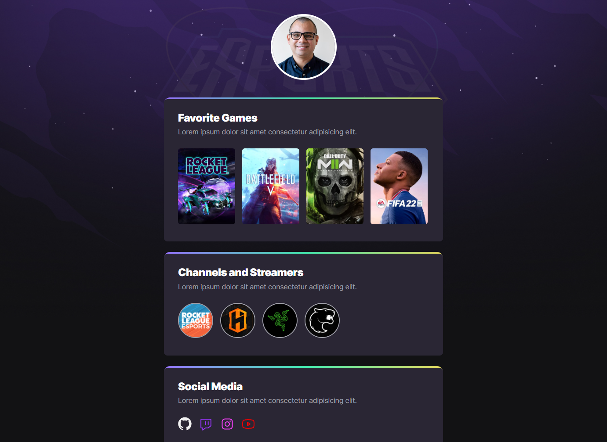

# `<nlw/>` eSports

## About this Project:
Next Level Project created with `RocketSeat`.
- HTML
- CSS
- Git and GitHub



## Project Links:
- Final Web Page: [nlw esports](https://mavinii.github.io/nlw-esports-explorer/).

- Figma Project: [nlw](https://www.figma.com/file/b1TZpRBYjG3hFAaqCpFT6M/NLW-eSports-(Community)?node-id=79%3A2502).

- Tutor Mayk Brito: [github](https://github.com/maykbrito).

## First Class:
State 1/5 | `Base Building`. We prepared our environment with all the bases to start our project.

## Second Class:
State 2/5 | `High Speed`. Hands on the coding and creation the project scructure with `html`:
```html
<main>
    <section>
        <div>
            <h2>Title goes here</h2>
            <p>Paragrapy goes here</p>

            <ul>
                <li>
                    <a>img1</a>
                    <a>img2</a>
                    <a>img3</a>
                </li>
            </ul>
        </div>
    </section>
</main>
```

## Third Class:
State 3/5 | `To be Continued`. In this class, we learned how to implement display: flex; in sections. How to reset the body's position and how to apply some concepts of figma in our application.

## Fourth Class:
State 4/5 | `Power Up`. For this class, I added the main image profile to the top of the page and some additional effects with :hover properties in css.

## Fifth Class:
State 5/5 | `Final Round`. What happened in this class was that, we uploaded the final project to github, creating a public link as well as uploaded the final project image.

## Copyright
This event is/was hosted by [RocketSeat](https://www.rocketseat.com.br).

Please note, this project is part of [RocketSeat](https://www.rocketseat.com.br) project, however, it may contain some parte of code that may be Copyright.

Please also note that, this project is non-profit or not intended to be monetized.